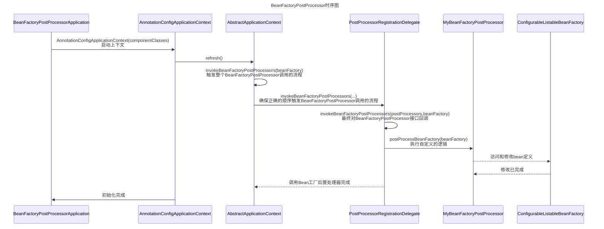

## BeanFactoryPostProcessor

- [BeanFactoryPostProcessor](#beanfactorypostprocessor)
  - [一、接口描述](#一接口描述)
  - [二、接口源码](#二接口源码)
  - [三、主要功能](#三主要功能)
  - [四、最佳实践](#四最佳实践)
  - [五、时序图](#五时序图)
  - [六、源码分析](#六源码分析)
  - [七、注意事项](#七注意事项)
  - [八、总结](#八总结)
    - [8.1、最佳实践总结](#81最佳实践总结)
    - [8.2、源码分析总结](#82源码分析总结)


### 一、接口描述

`BeanFactoryPostProcessor` 是一个接口，任何实现此接口的类都必须提供`postProcessBeanFactory`方法的实现。此方法提供了一个机会，在bean实例化之前修改bean的定义。

### 二、接口源码

`BeanFactoryPostProcessor` 是 Spring 框架自 06.07.2003 开始引入的一个核心接口。此接口提供了一个强大的方式来修改bean的属性和依赖关系，使得我们可以根据特定的配置或环境条件动态地调整这些值。

```java
/**
 * BeanFactoryPostProcessor 是一个核心接口，允许用户在Spring容器初始化bean之前修改bean定义。
 * 它提供了一个强大的方式来修改bean的属性和依赖关系，使得我们可以根据特定的配置或环境条件动态地调整这些值。
 * 
 * @author Juergen Hoeller
 * @author Sam Brannen
 * @since 06.07.2003
 * @see BeanPostProcessor
 * @see PropertyResourceConfigurer
 */
@FunctionalInterface
public interface BeanFactoryPostProcessor {

    /**
     * 在应用上下文的内部bean工厂进行其标准初始化后修改它。
     * 此时，所有bean定义都已加载，但尚未实例化任何bean。
     * 这允许用户即使对于急切初始化的beans也可以覆盖或添加属性。
     * 
     * @param beanFactory 应用上下文使用的bean工厂
     * @throws org.springframework.beans.BeansException 如果发生错误
     */
    void postProcessBeanFactory(ConfigurableListableBeanFactory beanFactory) throws BeansException;

}
```

### 三、主要功能

+ **修改Bean定义**：在Spring加载所有bean定义后，但在它开始实例化这些bean之前，`BeanFactoryPostProcessor`会被调用。这意味着我们可以使用它来修改这些bean定义。
+ **更改属性值**：你可以更改bean的属性或依赖，这在某些场景下，如需要根据环境或其他外部因素动态地配置bean时，会非常有用。
+ **添加或删除Bean定义**：不仅可以修改现有的bean定义，还可以添加新的bean定义或删除现有的bean定义。
+ **应用多个BeanFactoryPostProcessors**：如果有多个`BeanFactoryPostProcessor`，你可以通过实现`Ordered`接口来控制它们的执行顺序。

### 四、最佳实践

首先来看看启动类入口，上下文环境使用`AnnotationConfigApplicationContext`（此类是使用Java注解来配置Spring容器的方式），构造参数我们给定了一个`MyConfiguration`组件类。然后我们会调用`mySimpleBean1`和`mySimpleBean2`中的`show()`方法，我们可以判断`MySimpleBean`的作用域是单例还是原型。如果它们指向同一个实例，那么它是单例的；否则，它是原型的。

```java
public class BeanFactoryPostProcessorApplication {

    public static void main(String[] args) {
        AnnotationConfigApplicationContext context = new AnnotationConfigApplicationContext(MyConfiguration.class);

        MySimpleBean mySimpleBean1 = context.getBean(MySimpleBean.class);
        MySimpleBean mySimpleBean2 = context.getBean(MySimpleBean.class);

        mySimpleBean1.show();
        mySimpleBean2.show();
    }
}
```

这里使用`@Bean`注解，定义了两个Bean，是为了确保`MySimpleBean`， `MyBeanFactoryPostProcessor` 被 Spring 容器执行

```java
@Configuration
public class MyConfiguration {

    @Bean
    public MySimpleBean mySimpleBean(){
        return new MySimpleBean();
    }

    @Bean
    public static MyBeanFactoryPostProcessor myBeanFactoryPostProcessor(){
        return new MyBeanFactoryPostProcessor();
    }
}
```

`MySimpleBean`类中的`show`方法在被调用时，会在控制台输出“MySimpleBean instance”和当前对象的实例地址（通过`this`关键字）。这有助于我们了解每次获取bean时是否返回相同的实例（单例）还是新的实例（原型）。

```java
public class MySimpleBean {

    public void show() {
        System.out.println("MySimpleBean instance: " + this);
    }
}
```

这个 `MyBeanFactoryPostProcessor` 类是一个简单的 `BeanFactoryPostProcessor` 的实现，它在被调用时，会从`beanFactory`工厂中获取名为`mySimpleBean`的bean定义，默认情况下，所有的bean都是单例的，然后将`mySimpleBean`的作用域从单例改为原型。在实际应用中，你可能会在 `postProcessBeanFactory` 方法内部执行更复杂的操作，例如修改 bean 的属性、对Bean对象进行代理做功能增强处理、更改它们的作用域或添加新的 bean 定义等。

```java
public class MyBeanFactoryPostProcessor implements BeanFactoryPostProcessor {

    @Override
    public void postProcessBeanFactory(ConfigurableListableBeanFactory beanFactory) throws BeansException {
        System.out.println("修改bean的定义");
        BeanDefinition beanDefinition = beanFactory.getBeanDefinition("mySimpleBean");
        beanDefinition.setScope(BeanDefinition.SCOPE_PROTOTYPE);
        System.out.println("将mySimpleBean从默认的单例修改成多例");
        System.out.println("修改bean的定义已完成");
    }
}
```

运行结果发现，由于`mySimpleBean`现在是原型作用域，`[com.xcs.spring.config.MySimpleBean@11392934]`和`[com.xcs.spring.config.MySimpleBean@6892b3b6]`将是两个不同的地址，说明`MySimpleBean`的两个实例是不同的。

```java
修改bean的定义
将mySimpleBean从默认的单例修改成多例
修改bean的定义已完成
MySimpleBean instance: com.xcs.spring.config.MySimpleBean@11392934
MySimpleBean instance: com.xcs.spring.config.MySimpleBean@6892b3b6
```

### 五、时序图



### 六、源码分析

首先来看看启动类入口，上下文环境使用`AnnotationConfigApplicationContext`（此类是使用Java注解来配置Spring容器的方式），构造参数我们给定了一个`MyConfiguration`组件类。从Spring上下文中获取MySimpleBean的两个实例，调用这两个实例的show方法，如果MySimpleBean是单例的，那么这两个实例应该是同一个对象，反之则不是。

```java
public class BeanFactoryPostProcessorApplication {

    public static void main(String[] args) {
        AnnotationConfigApplicationContext context = new AnnotationConfigApplicationContext(MyConfiguration.class);

        MySimpleBean mySimpleBean1 = context.getBean(MySimpleBean.class);
        MySimpleBean mySimpleBean2 = context.getBean(MySimpleBean.class);

        mySimpleBean1.show();
        mySimpleBean2.show();
    }
}
```

在`org.springframework.context.annotation.AnnotationConfigApplicationContext#AnnotationConfigApplicationContext`构造函数中，执行了三个步骤，我们重点关注`refresh()`方法。

```java
public AnnotationConfigApplicationContext(Class<?>... componentClasses) {
    this();
    register(componentClasses);
    refresh();
}
```

在`org.springframework.context.support.AbstractApplicationContext#refresh`方法中我们重点关注一下`finishBeanFactoryInitialization(beanFactory)`这方法会对实例化所有剩余非懒加载的单列Bean对象，其他方法不是本次源码阅读的重点暂时忽略。

```java
@Override
public void refresh() throws BeansException, IllegalStateException {
     // ... [代码部分省略以简化]
     // 调用在上下文中注册为bean的工厂处理器
     invokeBeanFactoryPostProcessors(beanFactory);
     // ... [代码部分省略以简化]
}
```

在`org.springframework.context.support.AbstractApplicationContext#invokeBeanFactoryPostProcessors`方法中，又委托了`PostProcessorRegistrationDelegate.invokeBeanFactoryPostProcessors()`进行调用。

```java
protected void invokeBeanFactoryPostProcessors(ConfigurableListableBeanFactory beanFactory) {
    PostProcessorRegistrationDelegate.invokeBeanFactoryPostProcessors(beanFactory, getBeanFactoryPostProcessors());
    // ... [代码部分省略以简化]
}
```

在`org.springframework.context.support.PostProcessorRegistrationDelegate#invokeBeanFactoryPostProcessors`方法中，主要是对`BeanDefinitionRegistryPostProcessor`，`BeanFactoryPostProcessor`这两个接口的实现类进行回调，至于为什么这个方法里面代码很长呢？其实这个方法就做了一个事就是对处理器的执行顺序在做处理。比如说要先对实现了`PriorityOrdered.class`类回调，在对实现了`Ordered.class`类回调，最后才是对没有实现任何优先级的处理器进行回调。

```java
public static void invokeBeanFactoryPostProcessors(
        ConfigurableListableBeanFactory beanFactory, List<BeanFactoryPostProcessor> beanFactoryPostProcessors) {

    // ... [代码部分省略以简化]

    // 获取所有实现了BeanFactoryPostProcessor接口的bean的名称。
    String[] postProcessorNames =
        beanFactory.getBeanNamesForType(BeanFactoryPostProcessor.class, true, false);

    // 创建集合以区分不同类型的BeanFactoryPostProcessors
    List<BeanFactoryPostProcessor> priorityOrderedPostProcessors = new ArrayList<>();
    List<String> orderedPostProcessorNames = new ArrayList<>();
    List<String> nonOrderedPostProcessorNames = new ArrayList<>();

    // 对BeanFactoryPostProcessors进行分类
    for (String ppName : postProcessorNames) {
        if (processedBeans.contains(ppName)) {
            // 如果这个bean已经被处理，直接跳过
        }
        else if (beanFactory.isTypeMatch(ppName, PriorityOrdered.class)) {
            // 优先排序的BeanFactoryPostProcessors
            priorityOrderedPostProcessors.add(beanFactory.getBean(ppName, BeanFactoryPostProcessor.class));
        }
        else if (beanFactory.isTypeMatch(ppName, Ordered.class)) {
            // 有排序的BeanFactoryPostProcessors
            orderedPostProcessorNames.add(ppName);
        }
        else {
            // 没有排序的BeanFactoryPostProcessors
            nonOrderedPostProcessorNames.add(ppName);
        }
    }

    // 调用实现了PriorityOrdered接口的BeanFactoryPostProcessors
    sortPostProcessors(priorityOrderedPostProcessors, beanFactory);
    invokeBeanFactoryPostProcessors(priorityOrderedPostProcessors, beanFactory);

    // 调用实现了Ordered接口的BeanFactoryPostProcessors
    List<BeanFactoryPostProcessor> orderedPostProcessors = new ArrayList<>(orderedPostProcessorNames.size());
    for (String postProcessorName : orderedPostProcessorNames) {
        orderedPostProcessors.add(beanFactory.getBean(postProcessorName, BeanFactoryPostProcessor.class));
    }
    sortPostProcessors(orderedPostProcessors, beanFactory);
    invokeBeanFactoryPostProcessors(orderedPostProcessors, beanFactory);

    // 调用其他所有的BeanFactoryPostProcessors
    List<BeanFactoryPostProcessor> nonOrderedPostProcessors = new ArrayList<>(nonOrderedPostProcessorNames.size());
    for (String postProcessorName : nonOrderedPostProcessorNames) {
        nonOrderedPostProcessors.add(beanFactory.getBean(postProcessorName, BeanFactoryPostProcessor.class));
    }
    invokeBeanFactoryPostProcessors(nonOrderedPostProcessors, beanFactory);

    // 清除元数据缓存，因为BeanFactoryPostProcessors可能已修改bean定义
    beanFactory.clearMetadataCache();
}
```

下面是我画的一个关于`BeanFactoryPostProcessor`排序回调过程时序图大家可以参考一下。

~~~mermaid
sequenceDiagram
    Title: BeanFactoryPostProcessor回调排序时序图
    participant Init as invokeBeanFactoryPostProcessors
    participant BFPP_PO as BFPP(PriorityOrdered)
    participant BFPP_O as BFPP(Ordered)
    participant BFPP as 其余的BFPP

    Init->>BFPP_PO: 回调
    BFPP_PO-->>Init: 完成
    Init->>BFPP_O: 回调
    BFPP_O-->>Init: 完成
    Init->>BFPP: 回调
    BFPP-->>Init: 完成
    
    Note right of BFPP: 提示: 
    Note right of BFPP: BFPP = BeanFactoryPostProcessor

~~~

在`org.springframework.context.support.PostProcessorRegistrationDelegate#invokeBeanFactoryPostProcessors`方法中，循环调用了实现`BeanFactoryPostProcessor`接口中的`postProcessBeanFactory(registry)`方法

```java
private static void invokeBeanFactoryPostProcessors(
			Collection<? extends BeanFactoryPostProcessor> postProcessors, ConfigurableListableBeanFactory beanFactory) {

    for (BeanFactoryPostProcessor postProcessor : postProcessors) {
        StartupStep postProcessBeanFactory = beanFactory.getApplicationStartup().start("spring.context.bean-factory.post-process")
            .tag("postProcessor", postProcessor::toString);
        postProcessor.postProcessBeanFactory(beanFactory);
        postProcessBeanFactory.end();
    }
}
```

最后执行到我们自定义的逻辑中，在实际应用中，我们可以在 `postProcessBeanFactory` 方法内部执行更复杂的操作，例如修改 bean 的属性、对Bean对象进行代理做功能增强处理、更改它们的作用域或添加新的 bean 定义等。

```java
public class MyBeanFactoryPostProcessor implements BeanFactoryPostProcessor {

    @Override
    public void postProcessBeanFactory(ConfigurableListableBeanFactory beanFactory) throws BeansException {
        System.out.println("修改bean的定义");
        BeanDefinition beanDefinition = beanFactory.getBeanDefinition("mySimpleBean");
        beanDefinition.setScope(BeanDefinition.SCOPE_PROTOTYPE);
        System.out.println("将mySimpleBean从默认的单例修改成多例");
        System.out.println("修改bean的定义已完成");
    }
}
```

### 七、注意事项

**考虑其他的`BeanFactoryPostProcessor`**：在大型应用程序中，可能存在多个`BeanFactoryPostProcessor`。你需要确保它们不会互相冲突或导致不一致的bean定义。

**注意执行顺序**：如果有多个`BeanFactoryPostProcessor`，它们的执行顺序可能会影响结果。使用`Ordered`接口或`PriorityOrdered`接口来明确设置执行顺序。

**避免循环依赖**：修改bean定义可能会引入循环依赖。确保你充分理解bean之间的依赖关系，并尝试避免修改这些关系。比如当你修改了`BeanDefinition`构造函数，等等情况都有可能引入循环依赖。

**不要过度使用**：虽然`BeanFactoryPostProcessor`是一个非常强大接口，但这并不意味着我们就应该频繁使用它。只在真正需要的时候使用它，并考虑是否有其他更简单、更直观的方法可以达到同样的目的。

**谨慎使用**：虽然`BeanFactoryPostProcessor`是一个非常强大接口，允许你修改bean的定义。这意味着你可以更改bean的类、作用域、属性等。我们要在做这些更改时要非常小心，想想为什么要修改？影响的范围有多少？，以免引入不一致或不可预测的行为。

### 八、总结

#### 8.1、最佳实践总结

**初始化与配置**：

- 使用`AnnotationConfigApplicationContext`, 我们成功地启动了Spring容器并加载了`MyConfiguration`配置。
- 在`MyConfiguration`中, 我们定义了两个核心bean：`MySimpleBean`和`MyBeanFactoryPostProcessor`.

**修改Bean的作用域**：

- 虽然`MySimpleBean`默认是单例，但通过`MyBeanFactoryPostProcessor`，我们改变了这一默认行为，将其转变为原型作用域。
- 这种转变是通过覆盖`postProcessBeanFactory`方法并更改`mySimpleBean`的bean定义来完成的。

**验证修改**：

- 当我们从主应用程序获取`MySimpleBean`的两个实例并调用它们的`show`方法时，输出的实例地址明确地告诉我们这两个bean是不同的实例。

#### 8.2、源码分析总结

**启动与上下文**：利用 `AnnotationConfigApplicationContext`，我们初始化了Spring容器，并加载了`MyConfiguration`作为主要配置。

**核心调用**：Spring容器的`refresh`方法中，`invokeBeanFactoryPostProcessors(beanFactory)`确保所有的`BeanFactoryPostProcessor`得到适当的调用。

**回调顺序**：在Spring中，实现了`BeanFactoryPostProcessor`接口的bean不是随机调用的。Spring确保它们按照`PriorityOrdered`、`Ordered`和无顺序的层次结构进行分类和调用。

**自定义逻辑**：当我们实现`BeanFactoryPostProcessor`接口并提供自定义逻辑时（例如更改Bean的作用域），该逻辑将在上述过程的适当阶段被调用。

**具体实践**：通过具体示例，我们查看了如何利用`BeanFactoryPostProcessor`在bean实例化前更改bean定义。在我们的例子中，`MySimpleBean`的作用域从单例被更改为原型。